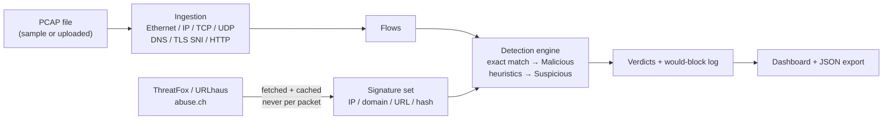

# Sentinel — Signature-Based Traffic Detection Engine

Sentinel ingests network traffic from a `.pcap` file, matches every flow
against real threat-intelligence indicators (IPs, domains, URLs, file
hashes), and classifies each one as **Benign**, **Suspicious**, or
**Malicious** — with a live web dashboard that shows every step of the
pipeline as it happens, not just the final verdict.

It's a Rust workspace: an Axum backend does the ingestion/matching/reporting,
and a small hand-written HTML/CSS/JS frontend (no build step, no framework)
renders it.



## Contents

- [Quick start](#quick-start)
- [Using the dashboard](#using-the-dashboard)
- [Architecture](#architecture)
- [Signature sources](#signature-sources)
- [Key design decisions](#key-design-decisions)
- [Tests](#tests)
- [Deployment](#deployment)

## Quick start

Requires a stable Rust toolchain (1.75+; needs `let`-`else`, stabilized in
1.65). No system libpcap, no root, no external services required to run the
full demo.

```bash
git clone <your-repo-url> sentinel
cd sentinel
cp .env.example .env          # optional — see "Signature sources" below

# Generate a small synthetic capture (benign + suspicious + malicious flows,
# no network or root needed):
cargo run --bin gen-sample-pcap

# Start the dashboard:
cargo run --bin sentinel
# -> Sentinel dashboard listening on http://127.0.0.1:8787
```

Open `http://127.0.0.1:8787`, then on **Ingest traffic** pick
`demo-traffic.pcap` and run ingestion, on **Signature sources** click
**Fetch signatures** (works with no API key — falls back to the bundled
offline sample set, see below), and on **Detections** click **Run
detection**. The **Report** page has the JSON export.

The same pipeline is available headless, for scripting or CI:

```bash
cargo run --bin sentinel -- run demo-traffic.pcap --source offline --export report.json
```

A capture file, not this repo's git history, is what's actually graded
here, so it's worth re-generating or re-capturing at any point — nothing
about the pipeline is hardcoded to one file.

## Using the dashboard

| Page | What it does |
|---|---|
| Overview | Session-wide pipeline status and the live activity log |
| Ingest traffic | Pick a bundled sample or upload your own `.pcap`; see assembled flows |
| Signature sources | Fetch/cache IOCs from ThreatFox and/or URLhaus, or load the offline set |
| Detections | Run the matcher; filter by verdict; click a row for the full match detail and the simulated IPS action |
| Report | Aggregate counts, a simple breakdown chart, and the JSON export |

Every action anywhere in the app is appended to the **pipeline activity**
log shown on every page (via Server-Sent Events at `/api/events`) — the
intent is that someone watching over your shoulder can follow exactly what
the engine is doing, not just see a final number.

## Architecture

```
src/
  main.rs            CLI (clap) + Axum router assembly
  config.rs           all env-derived configuration (no hardcoded values)
  models.rs           Flow, Signature, Verdict, Detection — pure data
  events.rs           PipelineEvent broadcast over SSE for the dashboard
  pipeline.rs         orchestrates ingest -> fetch signatures -> detect;
                      the only module that mutates shared state; used by
                      both the web API and the CLI, so they can't drift
  ingestion/
    pcap.rs            classic libpcap file reader (hand-rolled, no libpcap
                        dependency)
    parse.rs            Ethernet/IPv4/IPv6/TCP/UDP/DNS/TLS-SNI/HTTP parsers
    mod.rs               groups packets into bidirectional flows
  signatures/
    threatfox.rs         abuse.ch ThreatFox client
    urlhaus.rs            abuse.ch URLhaus client
    cache.rs               on-disk TTL cache (data/cache/signatures.json)
    mod.rs                  offline sample loader + source selection
  engine/
    matcher.rs            SignatureSet + classify() — the core, unit-tested
  api.rs               Axum HTTP handlers (thin — logic lives in pipeline.rs)
  report.rs            aggregate summary + CLI table rendering
  bin/gen_sample_pcap.rs  hand-crafts a demo capture, byte for byte
static/                plain HTML/CSS/JS dashboard (no build step)
data/sample_iocs.json  bundled offline IOC set (RFC 5737 addresses only)
```

Request flow for one detection run: the **Ingest** page POSTs a filename to
`/api/ingest`, which calls `pipeline::run_ingest`, which reads the file and
calls `ingestion::ingest_pcap_bytes` (pcap parsing -> per-packet field
extraction -> flow assembly) and stores the result in the shared `Store`
behind a `tokio::sync::RwLock`. The **Signatures** page POSTs to
`/api/signatures/fetch`, which checks the on-disk cache's age before ever
calling `threatfox`/`urlhaus`, and stores the resulting `SignatureSet`
alongside the flows. The **Detections** page POSTs to `/api/detect`, which
builds a `SignatureSet` (hash maps keyed by IP/domain/URL/hash, built once)
and calls `engine::classify` per flow. Every one of those steps calls
`AppState::emit`, which both logs via `tracing` and broadcasts a
`PipelineEvent` that the dashboard is subscribed to live.

## Signature sources

Sentinel integrates two independent abuse.ch community feeds, both free and
both authenticated with the same key:

- **[ThreatFox](https://threatfox.abuse.ch/)** — `POST
  https://threatfox-api.abuse.ch/api/v1/` with `{"query": "get_iocs",
  "days": 3}`. Returns recent IPs, domains, URLs, and file hashes tagged by
  malware family.
- **[URLhaus](https://urlhaus.abuse.ch/)** — `GET
  https://urlhaus-api.abuse.ch/v1/urls/recent/limit/100/`. Returns recently
  reported malicious URLs (and the IP/domain each resolves to).

Both require a free **Auth-Key** from <https://auth.abuse.ch/> — one key
authenticates both APIs. Put it in `.env` as `ABUSECH_AUTH_KEY` (see
`.env.example`). **Without a key configured, Sentinel automatically falls
back to `data/sample_iocs.json`**, a small bundled IOC set, so the whole
pipeline — including a genuine Malicious verdict — still works with zero
network access. The dashboard always shows which mode produced the current
signature set (the "offline sample" pill).

The bundled sample capture (`gen-sample-pcap`) intentionally talks to a
handful of IPs/domains that also appear in the offline sample set, so a
fully offline `cargo run` demonstrates every verdict end to end. Every
address it uses is inside an RFC 5737 documentation range
(`192.0.2.0/24`, `198.51.100.0/24`, `203.0.113.0/24`) reserved for exactly
this purpose — nothing points at real infrastructure.

Fetched signatures are cached to `data/cache/signatures.json` with a
configurable TTL (`SIGNATURE_CACHE_TTL_SECS`, default 1 hour). The engine
**never** calls a threat-intel API per packet or per flow — matching always
happens against the in-memory `SignatureSet` built once from whatever is
currently cached.

## Key design decisions

- **Hand-rolled pcap/packet parsing instead of `pcap`/`pnet` crates.**
  Reading the classic pcap container format and Ethernet/IPv4/IPv6/TCP/UDP
  headers is well-specified and small (see `ingestion/pcap.rs` and
  `ingestion/parse.rs`). Doing it directly means zero dependency on a
  system libpcap install — a `.pcap` file on disk is all that's needed, no
  root, matching the assignment's "no root needed" path. It also means the
  demo generator (`gen-sample-pcap`) and the reader are simple mirror
  images of each other, which made the whole path easy to reason about and
  verify without a live capture.
- **Flows are unordered-endpoint-pair keyed**, so both directions of one
  TCP/UDP exchange collapse into a single flow instead of appearing as two
  unrelated rows — closer to what "a connection" means to a human reading
  the dashboard.
- **Hostname discovery has a priority order:** TLS ClientHello SNI or a
  plaintext HTTP `Host:` header (found directly on the flow) beat a DNS
  query name; a DNS *response* seen anywhere in the capture also seeds a
  resolved-IP -> hostname map used to enrich flows that carry neither SNI
  nor HTTP. This means a malicious DNS lookup is itself flagged, before the
  TCP session that follows it even completes — arguably a feature, not just
  a detail (see the flow list a fresh `gen-sample-pcap` capture produces).
- **Exact-match priority is URL -> domain -> IP -> payload hash**, checked
  first and unconditionally winning as Malicious; only once none of those
  match does the engine fall through to the Suspicious heuristics. This
  keeps the matcher's behavior easy to state and easy to test (see
  `exact_match_always_wins_over_heuristics` in `engine/matcher.rs`).
- **A small, explicit set of Suspicious heuristics** rather than a scoring
  model: a high-entropy leftmost hostname label (cheap DGA proxy), a
  destination port commonly associated with backdoor/C2 tooling, and
  sharing a `/24` with a known-malicious IPv4 address. Each is independent,
  cheap to compute, and documented as a heuristic rather than a claim of
  ground truth — see [Known limitations](#known-limitations).
- **`pipeline.rs` is the only place that mutates state**, called
  identically by the Axum handlers and by the CLI's `run` subcommand. The
  web dashboard and the terminal summary are two views over the exact same
  code path, so they can't quietly drift apart.
- **Signature fetches are cached to disk with a TTL** and only ever
  triggered by an explicit user action (not on a timer, not per-request),
  directly satisfying "don't call the API per-packet — respect rate
  limits."
- **A bundled offline IOC set using only RFC 5737 documentation
  addresses**, paired with a synthetic pcap generator that targets the same
  addresses, so the entire assignment — including a real Malicious verdict
  — can be graded with zero network access and no API key.
- **Every pipeline action emits a `PipelineEvent`** over a
  `tokio::sync::broadcast` channel, consumed by the dashboard via SSE. This
  was the most direct way to satisfy "make the steps happening properly
  visible" — the log a third party sees in the browser is the same log the
  engine writes internally, not a separate summary written after the fact.

## Tests

```bash
cargo test
```

Unit tests live in `engine/matcher.rs` (the core, assignment-required
matching logic) and cover: benign passthrough, malicious IP match on both
destination and source, domain match (case-insensitive), URL match taking
priority over a weaker domain match, URL match ignoring a trailing slash,
payload-hash match, the entropy-based Suspicious heuristic (and that a
short hostname below the length threshold is *not* flagged even with high
entropy), the backdoor-port heuristic, the "shares a /24 with a known-bad
IP" heuristic, and that an exact match always wins over a heuristic that
would otherwise also apply.

## Deployment

**Docker** (build once, run anywhere):

```bash
docker build -t sentinel .
docker run -p 8787:8787 --env-file .env sentinel
```

**Bare metal / a VPS:**

```bash
cargo build --release
./target/release/sentinel serve --addr 0.0.0.0:8787
```

Put it behind a reverse proxy (Caddy/nginx) for TLS. Any host that runs a
long-lived process works (Fly.io, Render, a systemd unit on a VPS, etc.) —
the app is a single static binary plus the `static/`, `sample_pcaps/`, and
`data/` directories next to it.

## Demo

https://github.com/user-attachments/assets/3da2360d-58d4-4467-ba25-f03201fbe687


