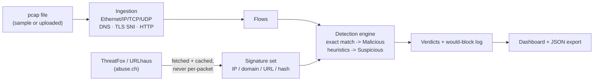

# Sentinel — Signature-Based Traffic Detection Engine

Sentinel ingests network traffic from a `.pcap` file, matches every flow
against real threat-intelligence indicators (IPs, domains, URLs, file
hashes), and classifies each one as **Benign**, **Suspicious**, or
**Malicious** — with a live web dashboard that shows every step of the
pipeline as it happens, not just the final verdict.

It's a Rust workspace: an Axum backend does the ingestion/matching/reporting,
and a small hand-written HTML/CSS/JS frontend (no build step, no framework)
renders it.



## Contents

- [Quick start](#quick-start)
- [Using the dashboard](#using-the-dashboard)
- [Architecture](#architecture)
- [Signature sources](#signature-sources)
- [Key design decisions](#key-design-decisions)
- [Known limitations](#known-limitations)
- [Tests](#tests)
- [Deployment](#deployment)
- [Understanding the concepts](#understanding-the-concepts)

## Quick start

Requires a stable Rust toolchain (1.75+; needs `let`-`else`, stabilized in
1.65). No system libpcap, no root, no external services required to run the
full demo.

```bash
git clone <your-repo-url> sentinel
cd sentinel
cp .env.example .env          # optional — see "Signature sources" below

# Generate a small synthetic capture (benign + suspicious + malicious flows,
# no network or root needed):
cargo run --bin gen-sample-pcap

# Start the dashboard:
cargo run --bin sentinel
# -> Sentinel dashboard listening on http://127.0.0.1:8787
```

Open `http://127.0.0.1:8787`, then on **Ingest traffic** pick
`demo-traffic.pcap` and run ingestion, on **Signature sources** click
**Fetch signatures** (works with no API key — falls back to the bundled
offline sample set, see below), and on **Detections** click **Run
detection**. The **Report** page has the JSON export.

The same pipeline is available headless, for scripting or CI:

```bash
cargo run --bin sentinel -- run demo-traffic.pcap --source offline --export report.json
```

A capture file, not this repo's git history, is what's actually graded
here, so it's worth re-generating or re-capturing at any point — nothing
about the pipeline is hardcoded to one file.

## Using the dashboard

| Page | What it does |
|---|---|
| Overview | Session-wide pipeline status and the live activity log |
| Ingest traffic | Pick a bundled sample or upload your own `.pcap`; see assembled flows |
| Signature sources | Fetch/cache IOCs from ThreatFox and/or URLhaus, or load the offline set |
| Detections | Run the matcher; filter by verdict; click a row for the full match detail and the simulated IPS action |
| Report | Aggregate counts, a simple breakdown chart, and the JSON export |

Every action anywhere in the app is appended to the **pipeline activity**
log shown on every page (via Server-Sent Events at `/api/events`) — the
intent is that someone watching over your shoulder can follow exactly what
the engine is doing, not just see a final number.

## Architecture

```
src/
  main.rs            CLI (clap) + Axum router assembly
  config.rs           all env-derived configuration (no hardcoded values)
  models.rs           Flow, Signature, Verdict, Detection — pure data
  events.rs           PipelineEvent broadcast over SSE for the dashboard
  pipeline.rs         orchestrates ingest -> fetch signatures -> detect;
                      the only module that mutates shared state; used by
                      both the web API and the CLI, so they can't drift
  ingestion/
    pcap.rs            classic libpcap file reader (hand-rolled, no libpcap
                        dependency)
    parse.rs            Ethernet/IPv4/IPv6/TCP/UDP/DNS/TLS-SNI/HTTP parsers
    mod.rs               groups packets into bidirectional flows
  signatures/
    threatfox.rs         abuse.ch ThreatFox client
    urlhaus.rs            abuse.ch URLhaus client
    cache.rs               on-disk TTL cache (data/cache/signatures.json)
    mod.rs                  offline sample loader + source selection
  engine/
    matcher.rs            SignatureSet + classify() — the core, unit-tested
  api.rs               Axum HTTP handlers (thin — logic lives in pipeline.rs)
  report.rs            aggregate summary + CLI table rendering
  bin/gen_sample_pcap.rs  hand-crafts a demo capture, byte for byte
static/                plain HTML/CSS/JS dashboard (no build step)
data/sample_iocs.json  bundled offline IOC set (RFC 5737 addresses only)
```

Request flow for one detection run: the **Ingest** page POSTs a filename to
`/api/ingest`, which calls `pipeline::run_ingest`, which reads the file and
calls `ingestion::ingest_pcap_bytes` (pcap parsing -> per-packet field
extraction -> flow assembly) and stores the result in the shared `Store`
behind a `tokio::sync::RwLock`. The **Signatures** page POSTs to
`/api/signatures/fetch`, which checks the on-disk cache's age before ever
calling `threatfox`/`urlhaus`, and stores the resulting `SignatureSet`
alongside the flows. The **Detections** page POSTs to `/api/detect`, which
builds a `SignatureSet` (hash maps keyed by IP/domain/URL/hash, built once)
and calls `engine::classify` per flow. Every one of those steps calls
`AppState::emit`, which both logs via `tracing` and broadcasts a
`PipelineEvent` that the dashboard is subscribed to live.

## Signature sources

Sentinel integrates two independent abuse.ch community feeds, both free and
both authenticated with the same key:

- **[ThreatFox](https://threatfox.abuse.ch/)** — `POST
  https://threatfox-api.abuse.ch/api/v1/` with `{"query": "get_iocs",
  "days": 3}`. Returns recent IPs, domains, URLs, and file hashes tagged by
  malware family.
- **[URLhaus](https://urlhaus.abuse.ch/)** — `GET
  https://urlhaus-api.abuse.ch/v1/urls/recent/limit/100/`. Returns recently
  reported malicious URLs (and the IP/domain each resolves to).

Both require a free **Auth-Key** from <https://auth.abuse.ch/> — one key
authenticates both APIs. Put it in `.env` as `ABUSECH_AUTH_KEY` (see
`.env.example`). **Without a key configured, Sentinel automatically falls
back to `data/sample_iocs.json`**, a small bundled IOC set, so the whole
pipeline — including a genuine Malicious verdict — still works with zero
network access. The dashboard always shows which mode produced the current
signature set (the "offline sample" pill).

The bundled sample capture (`gen-sample-pcap`) intentionally talks to a
handful of IPs/domains that also appear in the offline sample set, so a
fully offline `cargo run` demonstrates every verdict end to end. Every
address it uses is inside an RFC 5737 documentation range
(`192.0.2.0/24`, `198.51.100.0/24`, `203.0.113.0/24`) reserved for exactly
this purpose — nothing points at real infrastructure.

Fetched signatures are cached to `data/cache/signatures.json` with a
configurable TTL (`SIGNATURE_CACHE_TTL_SECS`, default 1 hour). The engine
**never** calls a threat-intel API per packet or per flow — matching always
happens against the in-memory `SignatureSet` built once from whatever is
currently cached.

## Key design decisions

- **Hand-rolled pcap/packet parsing instead of `pcap`/`pnet` crates.**
  Reading the classic pcap container format and Ethernet/IPv4/IPv6/TCP/UDP
  headers is well-specified and small (see `ingestion/pcap.rs` and
  `ingestion/parse.rs`). Doing it directly means zero dependency on a
  system libpcap install — a `.pcap` file on disk is all that's needed, no
  root, matching the assignment's "no root needed" path. It also means the
  demo generator (`gen-sample-pcap`) and the reader are simple mirror
  images of each other, which made the whole path easy to reason about and
  verify without a live capture.
- **Flows are unordered-endpoint-pair keyed**, so both directions of one
  TCP/UDP exchange collapse into a single flow instead of appearing as two
  unrelated rows — closer to what "a connection" means to a human reading
  the dashboard.
- **Hostname discovery has a priority order:** TLS ClientHello SNI or a
  plaintext HTTP `Host:` header (found directly on the flow) beat a DNS
  query name; a DNS *response* seen anywhere in the capture also seeds a
  resolved-IP -> hostname map used to enrich flows that carry neither SNI
  nor HTTP. This means a malicious DNS lookup is itself flagged, before the
  TCP session that follows it even completes — arguably a feature, not just
  a detail (see the flow list a fresh `gen-sample-pcap` capture produces).
- **Exact-match priority is URL -> domain -> IP -> payload hash**, checked
  first and unconditionally winning as Malicious; only once none of those
  match does the engine fall through to the Suspicious heuristics. This
  keeps the matcher's behavior easy to state and easy to test (see
  `exact_match_always_wins_over_heuristics` in `engine/matcher.rs`).
- **A small, explicit set of Suspicious heuristics** rather than a scoring
  model: a high-entropy leftmost hostname label (cheap DGA proxy), a
  destination port commonly associated with backdoor/C2 tooling, and
  sharing a `/24` with a known-malicious IPv4 address. Each is independent,
  cheap to compute, and documented as a heuristic rather than a claim of
  ground truth — see [Known limitations](#known-limitations).
- **`pipeline.rs` is the only place that mutates state**, called
  identically by the Axum handlers and by the CLI's `run` subcommand. The
  web dashboard and the terminal summary are two views over the exact same
  code path, so they can't quietly drift apart.
- **Signature fetches are cached to disk with a TTL** and only ever
  triggered by an explicit user action (not on a timer, not per-request),
  directly satisfying "don't call the API per-packet — respect rate
  limits."
- **A bundled offline IOC set using only RFC 5737 documentation
  addresses**, paired with a synthetic pcap generator that targets the same
  addresses, so the entire assignment — including a real Malicious verdict
  — can be graded with zero network access and no API key.
- **Every pipeline action emits a `PipelineEvent`** over a
  `tokio::sync::broadcast` channel, consumed by the dashboard via SSE. This
  was the most direct way to satisfy "make the steps happening properly
  visible" — the log a third party sees in the browser is the same log the
  engine writes internally, not a separate summary written after the fact.

## Known limitations

- **Classic pcap only, not pcapng.** Most modern capture tools default to
  pcapng; convert first with `tshark -F pcap -r in.pcapng -w out.pcap`
  (noted in `sample_pcaps/README.md` and surfaced as a warning in the UI if
  a file parses to zero packets).
- **No TCP stream reassembly.** SNI/HTTP extraction looks at a single
  packet's payload. A ClientHello or HTTP request split across multiple TCP
  segments (common with larger requests, or if an intermediate device
  fragments them) won't be found. This is the single biggest accuracy gap
  versus a real IDS like Suricata/Zeek, which reassemble streams.
- **IP/TCP/UDP checksums are not validated**, and IP fragmentation is not
  reassembled — a flow spanning multiple IP fragments will only see the
  first fragment's payload.
- **The DGA heuristic is a cheap entropy proxy**, not a trained model. It
  will miss dictionary-based DGAs and will occasionally flag legitimate
  hostnames that happen to look random (e.g. some CDN/cloud-provider
  subdomains). It exists to demonstrate the *shape* of an evasion-aware
  heuristic, not to claim AV-grade DGA detection — see the discussion
  below.
- **MD5-only hash IOCs are not matched.** The engine only ever computes
  SHA-256 over payloads, so ThreatFox indicators typed as MD5 are dropped
  at ingestion rather than stored as an indicator that can never fire.
- **Hash-based (AV-style) matching is necessarily limited for network
  traffic**: it hashes the observed transport-layer payload of the first
  payload-bearing packet per flow, which is not the same thing as hashing a
  complete reassembled file — a real AV engine hashes files, not packets.
  Treat this strictly as the bonus path the assignment describes it as.
- **In-memory state resets on restart** (except the signature cache on
  disk). There's no database — flows/detections for the current session
  live in an `RwLock<Store>` inside the running process. Fine for a
  demo/analysis tool; not meant for a long-running production sensor as-is.
- **Single-process, single-capture-at-a-time.** The dashboard is designed
  around "load one capture, analyze it, look at the results," not
  concurrent multi-tenant analysis.

## Tests

```bash
cargo test
```

Unit tests live in `engine/matcher.rs` (the core, assignment-required
matching logic) and cover: benign passthrough, malicious IP match on both
destination and source, domain match (case-insensitive), URL match taking
priority over a weaker domain match, URL match ignoring a trailing slash,
payload-hash match, the entropy-based Suspicious heuristic (and that a
short hostname below the length threshold is *not* flagged even with high
entropy), the backdoor-port heuristic, the "shares a /24 with a known-bad
IP" heuristic, and that an exact match always wins over a heuristic that
would otherwise also apply.

## Deployment

**Docker** (build once, run anywhere):

```bash
docker build -t sentinel .
docker run -p 8787:8787 --env-file .env sentinel
```

**Bare metal / a VPS:**

```bash
cargo build --release
./target/release/sentinel serve --addr 0.0.0.0:8787
```

Put it behind a reverse proxy (Caddy/nginx) for TLS. Any host that runs a
long-lived process works (Fly.io, Render, a systemd unit on a VPS, etc.) —
the app is a single static binary plus the `static/`, `sample_pcaps/`, and
`data/` directories next to it.

## Understanding the concepts

### Signature-based vs. anomaly/behavior-based detection

Signature-based detection (what this project builds) matches observed
traffic against a database of *known* indicators — this exact IP, this
exact domain, this exact file hash. It's precise and cheap: a match means
very high confidence, and it's easy to say *why* something fired. Its
weakness is coverage — it can only catch what's already been seen and
cataloged somewhere.

Anomaly/behavior-based detection instead builds a model of "normal" (for a
host, a user, a network) and flags deviations from it, without needing to
have seen the specific attack before.

- An attack that **defeats signature-based detection**: a brand-new
  (zero-day) malware family, or the same known malware repacked/recompiled
  so its file hash changes — nothing in the signature database matches, so
  a purely signature-based engine sees nothing wrong at all.
- An attack that **defeats anomaly-based detection**: a "living off the
  land" attack that only uses tools and traffic patterns already normal on
  that network (e.g. an attacker using PowerShell and standard HTTPS to an
  allowed cloud storage provider for command-and-control) — nothing about
  the *behavior* looks unusual, even though the intent is malicious.

In practice, production systems layer both: signatures for cheap,
high-confidence catches of known threats, anomaly/behavior models to catch
what signatures structurally can't.

### Evasion techniques against exact-match signatures

This engine matches exact IOC values, so it inherits that approach's
classic weaknesses. Two real techniques attackers use, and how the engine
could be extended for each (some of this is already sketched in above):

1. **DGA (Domain Generation Algorithms).** Malware computes a large set of
   pseudo-random candidate domains (often seeded by date, so the set
   rotates daily) and tries them until one resolves — the attacker only
   needs to register one of thousands of possible names. A static domain
   IOC list can never keep up. This project's entropy heuristic
   (`looks_like_dga` in `engine/matcher.rs`) is a first step in that
   direction; a production system would go further with a trained
   classifier (n-gram/character-level models scored against a corpus of
   known-benign and known-DGA domains), tracking NXDOMAIN response *rate*
   per host (a host that fails dozens of lookups per minute before one
   succeeds is a strong DGA tell independent of any single domain's
   spelling), and cross-referencing candidate domains against a feed of
   known DGA seeds where available.
2. **Fast-flux / IP fronting.** Fast-flux rotates the IP address(es) behind
   a malicious domain rapidly (sometimes every few minutes) across a large
   pool of compromised hosts, so blocking one IP does nothing. IP/domain
   fronting instead hides the real destination behind a shared, reputable
   front (e.g. a CDN or major cloud provider's IP/hostname at the TCP/TLS
   layer, with the real target only revealed inside an encrypted HTTP
   `Host` header or an SNI-hiding technique like Encrypted Client Hello),
   so the network-visible endpoint looks benign even though traffic is
   ultimately headed somewhere malicious. The `/24`-neighbor heuristic here
   is a small step toward fast-flux resilience (catching IPs *near* a known
   one); a production extension would track a domain's resolved-IP set over
   time and flag unusually high churn, maintain IOCs at the ASN or
   hosting-provider level rather than single IPs, and — for fronting
   specifically — compare the SNI/ClientHello-visible hostname against the
   HTTP `Host` header of the same session (a persistent mismatch, where
   infrastructure normally doesn't split them, is itself a signal). Note
   this last one only works where TLS isn't also hiding the SNI itself.

### Cost of a false positive vs. a false negative if this ran in-line as an IPS

Right now this engine only *detects* — Malicious verdicts log a
"would-block" decision but nothing is actually dropped. If it graduated to
running in-line and actually enforcing that block:

- **A false positive** (blocking a benign flow) has an immediate, visible,
  and attributable cost: a real user or service is broken *right now*,
  support tickets get filed, and — critically — repeated false positives
  train operators to distrust and eventually disable or bypass the IPS
  entirely, which quietly destroys its value even for the traffic it gets
  right.
- **A false negative** (letting a malicious flow through) has a delayed,
  often invisible cost: nothing breaks today, but the compromise proceeds
  silently, and the eventual damage (data exfiltration, lateral movement,
  ransomware) can be far larger than a blocked login page ever was — and by
  the time it's discovered, attribution back to "the IPS missed this" is
  much harder than a false positive's instant, loud failure.

Because the two failure modes have such different cost *shapes* — false
positives are immediate/loud/cheap-but-annoying, false negatives are
delayed/silent/potentially catastrophic — tuning isn't just "pick one error
rate," it's routing by confidence:

- **High-confidence exact matches** (this project's Malicious path — a
  direct IOC hit from a reputable feed) are cheap to act on immediately:
  block/drop in-line, since the false-positive rate on an exact match
  against a maintained feed is low and the cost of missing a confirmed-bad
  IOC is high.
- **Lower-confidence heuristic matches** (this project's Suspicious path)
  are exactly where blocking in-line is the wrong tuning: false positives
  there are structurally more likely (an entropy heuristic *will* catch
  some legitimate randomly-named hosts), so the safer action is
  alert/log/rate-limit/quarantine-for-review rather than an automatic
  block, escalating to a block only after corroboration (repeated
  occurrences, a second independent signal, analyst confirmation).
- Where the traffic is business-critical, bias further toward false
  negatives over false positives (a missed detection is recoverable with
  monitoring and incident response; an outage on a production payment path
  is not) — and where the asset is high-value/high-risk (e.g. an admin jump
  box), bias the other way.

That confidence-based routing is exactly why this project keeps Malicious
(exact match) and Suspicious (heuristic) as structurally separate verdicts
with different downstream actions, rather than collapsing them into a
single score.
